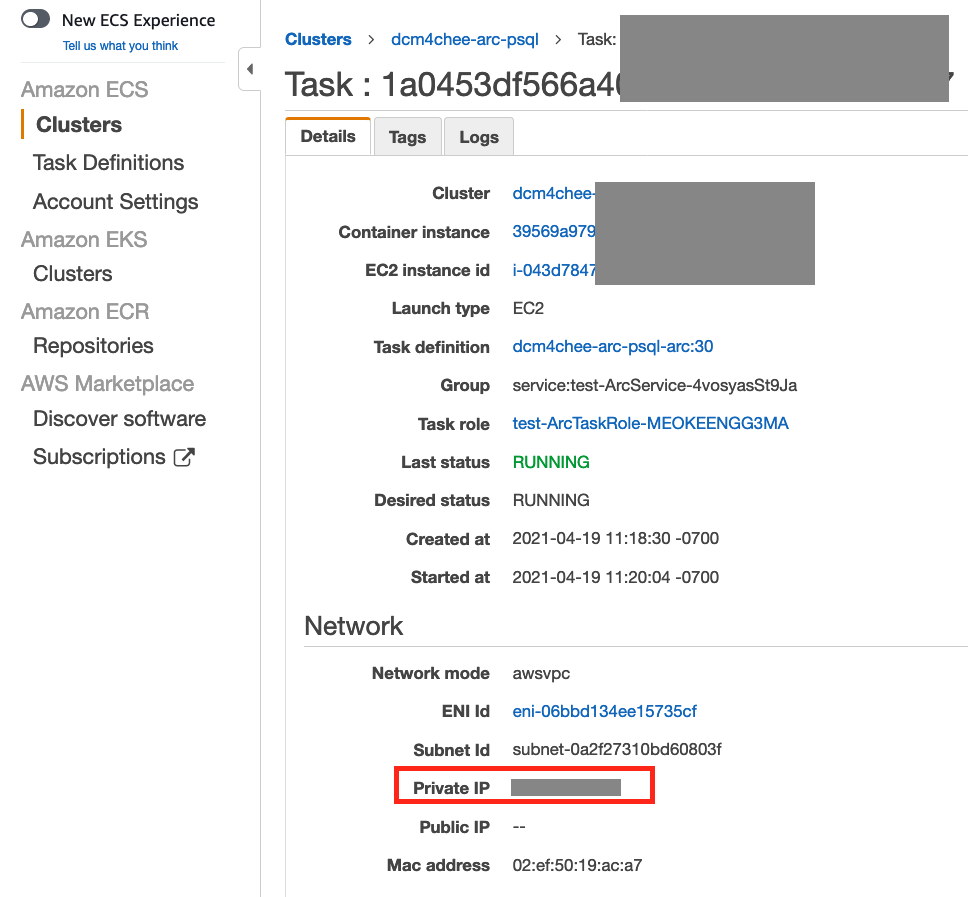

## Deploy Open Source [DCM4CHEE](https://www.dcm4che.org/) on AWS

[DCM4CHEE](https://github.com/dcm4che/dcm4chee-arc-light) has been containerized and can run on [AWS ECS](https://aws.amazon.com/ecs). The data is stored in the [AWS EFS](https://aws.amazon.com/efs/) mounted to DCM4CHEE server and the [AWS RDS](https://aws.amazon.com/rds/) PostgreSQL database. 

The diagram of Architecture is here:


#### Pre-requisite

First create the network infrastructure. One way to do it is to deploy using [this CloudFormation template](https://docs.aws.amazon.com/codebuild/latest/userguide/cloudformation-vpc-template.html), which will create one [AWS VPC](https://aws.amazon.com/vpc/), two public subnets and two private subnets. If you want to add [VPC flow logs](https://docs.aws.amazon.com/vpc/latest/userguide/flow-logs.html), you can deploy [the network infrastructure CloudFormation template](https://github.com/aws-samples/digital-pathology-on-aws/blob/main/OMERO-cloudformation-templates/OMERONetworkInfra.yaml) in this repository and select true for AddVPCFlowLog parameter.

#### Deploy DCM4CHEE Stack

Next the DCM4CHEE stack can be deployed using this 1-click deployment:  
[](https://console.aws.amazon.com/cloudformation/home?region=us-east-1#/stacks/create/template?stackName=dcm4cheeec2stack&templateURL=https://dcm4chee-on-aws.s3.amazonaws.com/dcm4chee-arc-ec2-psql.yml)

You can connect to the EC2 instance that host the dcm4chee archive server container using either SSH client (login as ec2-user) or Session Manager (login as ssm-user). Once connected, you can unzip the pre-downloaded dcm4chee binary zipped file to run command line scripts:

``` 
cd   
unzip /tmp/dcm4che-5.23.2-bin.zip   
cd dcm4che-5.23.2/   
bin/storescu -c STORESCP@<container private ip>:11112   
``` 

The archive server container instance has been assigned with a private IP address vis awsvpc network deployment. The IP address can be found on AWS console ECS Cluster => Task => Task detail page:  


#### Reference 

The following information was used to build this solution:
1. [DCM4CHEE Docker](https://github.com/dcm4che/dcm4chee-arc-light)
2. [Deploying Docker containers on ECS](https://docs.docker.com/cloud/ecs-integration/)
3. [Tutorial on EFS for ECS EC2 launch type](https://docs.aws.amazon.com/AmazonECS/latest/developerguide/tutorial-efs-volumes.html)  
4. [Blog post on EFS for ECS Fargate](https://aws.amazon.com/blogs/aws/amazon-ecs-supports-efs/)  
5. [Blog post on EFS as Docker volume](https://aws.amazon.com/blogs/compute/amazon-ecs-and-docker-volume-drivers-amazon-ebs/)  


## Security

See [CONTRIBUTING](CONTRIBUTING.md#security-issue-notifications) for more information.

## License

This library is licensed under the MIT-0 License. See the LICENSE file.


