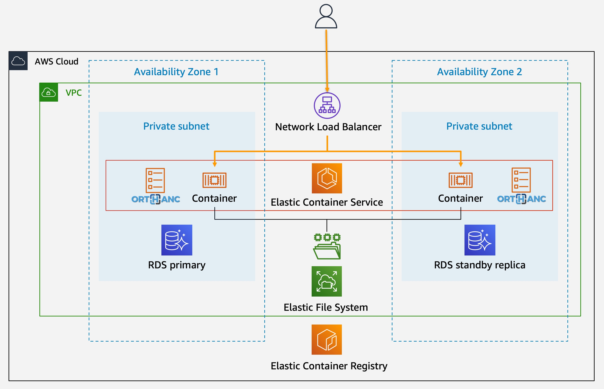

# Orthanc on AWS

This solution deploys the [Orthanc](https://www.orthanc-server.com/) DICOM image server on the AWS cloud.  It creates an internet-accessible service providing DICOM transport over the DICOM DIMSE and DICOMWeb protocols, and runs on a managed container platform backed by fully-managed database and file storage.

## Description

The architecture of the solution comprises a highly-available container service running one or more containerized Orthanc instances, hosted on [Amazon Elastic Container Service](https://aws.amazon.com/ecs) (ECS).  The Orthanc instances reside behind a [Network Load Balancer](https://docs.aws.amazon.com/elasticloadbalancing/latest/network/introduction.html), which ensures continuity of service by replacing unhealthy instances and which can scale to accommodate demand.  The load balancer provides the internet endpoint for the solution on the ports for DICOM DIMSE and DICOMWeb, which are configurable.

Storage for the image files is provided by [Amazon Elastic File System](https://aws.amazon.com/efs/) (EFS), which is mounted on each running Orthanc instance, and the image indexes are stored in PostgreSQL hosted on [Amazon Relational Database Service](https://aws.amazon.com/rds/) (RDS).  The EFS store and RDS database are automatically backed up to [Amazon S3](https://aws.amazon.com/s3/), and the data stored on EFS is transitioned to a lower-cost [Infrequent Access](https://aws.amazon.com/efs/features/infrequent-access/) storage tier after a configurable period.

Both the EFS file store, and RDS database, are encrypted at rest, and the DICOMWeb transport and Orthanc REST API use encrypted HTTPS, which is terminated at the network load balancer.

## Installation

### Create a VPC

This solution requires a pre-existing * An existing [Virtual Private Cloud](https://aws.amazon.com/vpc) (VPC) within your account.  It is recommended that the solution is deployed across multiple availability zones (AZs), and a suitable multi-AZ VPC for this purpose can be created by deploying the AWS [Modular and Scalable VPC Architecture](https://aws.amazon.com/quickstart/architecture/vpc/) QuickStart.

### Deploy the Solution

The deployment process is fully automated and performed by [AWS CloudFormation](https://aws.amazon.com/cloudformation) running the template file [orthanc-rds-template.yaml](https://github.com/aws-samples/open-source-medical-imaging-tools-on-aws/blob/main/orthanc/orthanc-rds-template.yaml).  This can be accomplished in three ways:
* Log in to the AWS Console and click the link below.  This will open the AWS CloudFormation console with the template file pre-filled.

* Clone this repository, and from the AWS CloudFormation console, select and launch the `orthanc-rds-template.yaml` template.  This is useful if you wish to modify the template before deployment.
* Deploy from the [AWS Command Line Interface](https://aws.amazon.com/cli/).  To do this, edit the configuration file `orthanc-config.json` with the values that will be supplied to the CloudFormation template, then launch the CloudFormation stack with the command `aws cloudformation create-stack --cli-input-json file://orthanc-config.json`. This approach is useful during experimentation, to speed the repeated deployment of the solution.

### Configuration

The template file accepts configuration values for the Orthanc instances, and the AWS infrastructure including networking, ECS container service, EFS file service, RDS database service, and IAM identity and access management.

| Name | Default | Description |
| -- | -- | -- |
| `Namespace` | `orthanc` | String to be included in the name of most components.  This allows multiple deployments to exist in the same account.  Must comprise 4-20 letters and digits, starting with a letter.
| `ContainerOnEC2` | `N` | Whether to run the ECS service on EC2 or [AWS Fargate](https://aws.amazon.com/fargate) serverless compute for containers. `Y` = EC2, `N` = Fargate.
| `ContainerImageUrl` | `osimis/orthanc` | Name of the Orthanc container image.  By default, use the [Osimis](https://www.osimis.io/en/) image, which contains all Orthanc plugins.

---

__TODO: COMPLETE CONFIGURATION DOCUMENTATION__

---

## Authors

These solutions were developed by AWS Solutions Architects and are provided as [AWS Samples](https://github.com/aws-samples/).

## License

This project is licensed under the [MIT-0](https://github.com/aws/mit-0) License - see the LICENSE file for details
